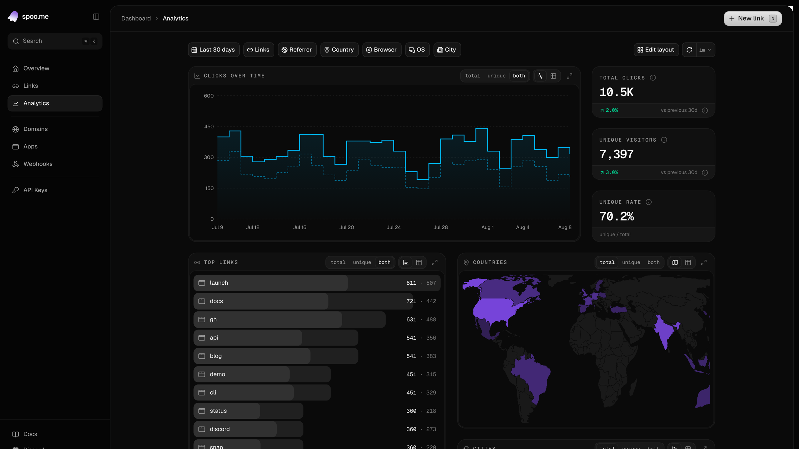
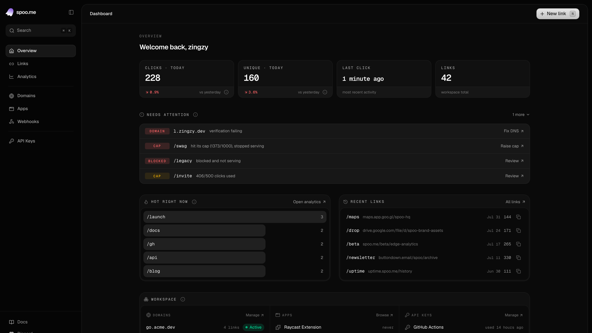
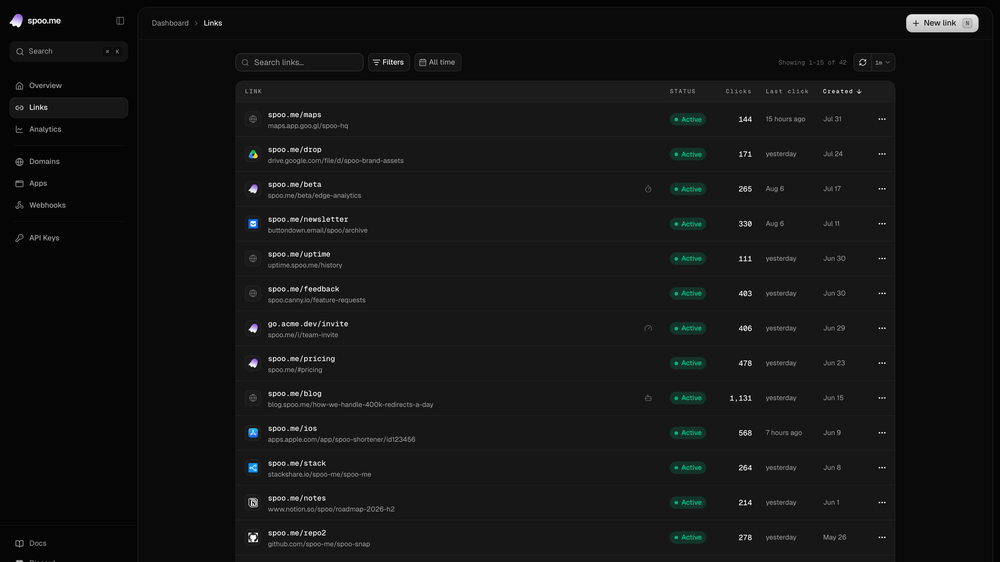
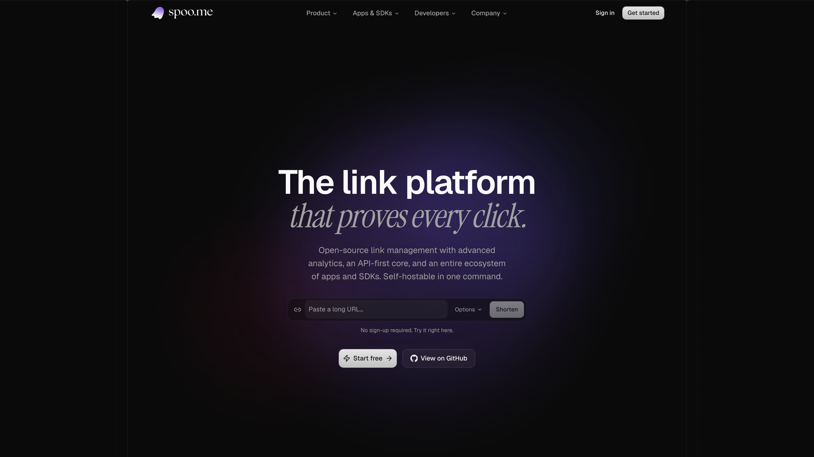

<h3 align="center">spoo.me frontend</h3>
<p align="center">The web app behind spoo.me: landing, auth, dashboard and analytics 🖥️</p>

<p align="center">
    <a href="#-introduction"><kbd>⚡ Introduction</kbd></a>
    <a href="#-whats-in-here"><kbd>🧩 What's in here</kbd></a>
    <a href="#-getting-started"><kbd>🚀 Getting Started</kbd></a>
    <a href="#-project-layout"><kbd>🗂️ Project Layout</kbd></a>
    <a href="#-contributing"><kbd>🤝 Contributing</kbd></a>
</p>

<p align="center">
<a href="https://spoo.me"></a>
<a href="https://github.com/spoo-me/frontend/actions/workflows/ci.yml"></a>
<a href="LICENSE"></a>
<a href="https://spoo.me/discord"></a>
<a href="https://twitter.com/spoo_me"></a>
</p>

# ⚡ Introduction

**[spoo.me](https://spoo.me)** is a free, open-source link management platform: short links, custom slugs, emoji slugs, password protection, link lifespans and deep click analytics, all behind a documented API.

This repository is the **frontend**. Everything a browser touches lives here: the marketing site, sign-in and onboarding, the dashboard, the public per-link stats and preview pages, and the error pages the edge composes. The backend (FastAPI, MongoDB, Redis) lives in **[spoo-me/spoo](https://github.com/spoo-me/spoo)**.

|[Live app 🔗](https://spoo.me)|[Backend repo 🐍](https://github.com/spoo-me/spoo)|[API docs 🛠️](https://spoo.me/api)|
|---|---|---|

## 📸 A look around

The analytics board: a drag-and-resize widget grid over the same click data the API exposes.



<details>
<summary>More screens</summary>

**Overview**: the daily briefing, today's numbers, what needs attention, what is hot right now.



**Links**: the workspace table, filterable, with per-link settings in a side sheet.



**Landing**: shorten without an account, straight from the hero.



</details>

> [!NOTE]
> Every screenshot above is the app running against the built-in mock backend (`npm run dev:mock`), on seeded data. No real accounts or links.

# 🧩 What's in here

- `Landing` - hero shortener, feature sections, apps and SDKs directory, testimonials, pricing 🏠
- `Auth` - sign in, sign up with email OTP, OAuth (Google, GitHub, Discord), password reset 🔑
- `Onboarding` - a branching wizard that ends with a link you actually made 🧭
- `Dashboard` - overview, links, analytics, domains, connected apps, webhooks, API keys, account settings 📊
- `Analytics board` - a resizable widget grid: time series, breakdowns, world map, treemap, radar, heatmap 📈
- `Link editing` - slugs and emoji slugs, passwords, expiry, click caps, bot blocking, geo rules, A/B variants, meta tags 🔧
- `Public pages` - per-link stats at `/stats/{code}` and the safety preview at `/{code}+` 🔍
- `Error pages` - 404 / 410 / 429 / 451 / 5xx, composed at the edge from backend statuses 🚧
- `Intake` - abuse reporting (single and bulk) and contact, both captcha-gated for anonymous senders 🛡️
- `Mock backend` - the whole app running on a seeded in-memory dataset, no services required 🧪

# 🚀 Getting Started

### 📋 Prerequisites

- [Node.js](https://nodejs.org) 22 or newer 🟩

### 📂 Clone and install

```bash
git clone https://github.com/spoo-me/frontend.git
cd frontend
npm install
```

### 🧪 Run it with no backend at all

```bash
npm run dev:mock
```

Open <http://localhost:3001>. This is the fastest way in and the way to develop most UI.

`SPOO_MOCK=1` points the same-origin proxy at in-repo mock handlers instead of the real API, so the real pages run the real flow against canned responses. The dataset is seeded from a fixed PRNG, so the numbers are the same on every restart.

- Any email and password signs in, any 6 digits pass the OTP step
- The workspace comes pre-filled with links, domains, webhooks, keys and click history
- State lives in the dev-server process. Restart, or hit `GET /api/mock/reset`, to start over

<details>

<summary>Expand this to run against the real backend</summary>

### 🔌 Point it at an API

```bash
npm run dev
```

Open <http://localhost:3000>. This expects a spoo.me backend on `http://localhost:8000` (the default from the [backend repo](https://github.com/spoo-me/spoo)'s `docker-compose`). Override with `SPOO_API_URL`.

`/auth/*`, `/oauth/*` and `/api/v1/*` are rewritten to that origin from the same Next server, which keeps the HttpOnly auth cookies first-party and avoids CORS entirely.

### ➕ Optional environment variables

Every one of these is optional and every one degrades to a no-op when unset. `lib/flags.ts` is the single registry, so one read of that file lists every switch.

```bash
SPOO_API_URL=http://localhost:8000   # backend origin for the proxy

NEXT_PUBLIC_PRICING=                 # 1 shows the /pricing surface
NEXT_PUBLIC_HCAPTCHA_SITEKEY=        # unset skips the captcha step entirely
NEXT_PUBLIC_POSTHOG_KEY=             # unset disables product analytics
NEXT_PUBLIC_CLARITY_ID=              # unset disables session replay
NEXT_PUBLIC_SENTRY_DSN=              # unset disables browser error reporting
```

> [!IMPORTANT]
> `NEXT_PUBLIC_*` values are inlined into the client bundle at build time, not read at runtime. In Docker they must arrive as build args, and changing one means a rebuild.

### 🐳 Docker

```bash
docker build -t spoo-frontend .
docker run -p 3000:3000 -e SPOO_API_URL=http://host.docker.internal:8000 spoo-frontend
```

The image is a multi-stage build ending on Next's standalone output: no `node_modules` at runtime, non-root user, a health endpoint at `/api/health`.

</details>

# 🗂️ Project Layout

```
app/
  page.tsx              landing
  (auth)/               login, signup, forgot-password
  onboarding/           welcome, verify, path, then link/domain/api/apps/claim, then recap
  dashboard/            overview, links, analytics, domains, apps, webhooks,
                        developer (API keys), settings
  stats/[code]/         public per-link stats
  preview/[code]/       safety preview, served at the public URL /{code}+
  error-pages/[status]/ edge-composed 404 / 410 / 429 / 451 / 5xx
  report/, contact/     abuse and support intake
  apps/, pricing/       ecosystem directory, plans
  legal/, privacy/, terms/, about/, testimonials/
  api/mock/[...path]/   the mock backend (SPOO_MOCK=1 only)
  api/health/           container health probe
components/
  sections/             landing sections
  dashboard/            dashboard shell, links UI, analytics widgets
  onboarding/, auth/, stats-public/, preview/, errors/, report/
  layout/, shared/, icons/
  ui/                   shadcn + Magic UI + Aceternity primitives
lib/
  api/                  typed clients, one module per backend surface
  flags.ts              every NEXT_PUBLIC_* switch, and what it hides
  site-config.ts        site metadata, nav, footer, public stats
  apps-data.ts          connected apps and SDK registry
hooks/                  shared React hooks
proxy.ts                auth gate for /, /dashboard/*, /onboarding/*
next.config.mjs         rewrites: API proxy, /{code}+, /_error/{status}
public/                 brand assets, geo topojson, security.txt
```

## 🧱 Stack

- **[Next.js 16](https://nextjs.org)** App Router, Turbopack, standalone output
- **React 19** and TypeScript in strict mode
- **[Tailwind CSS v4](https://tailwindcss.com)** with **[shadcn/ui](https://ui.shadcn.com)** (radix-nova) primitives
- **[TanStack Query](https://tanstack.com/query)** for server state, **[nuqs](https://nuqs.dev)** for URL state
- **[Recharts](https://recharts.org)** and **[react-grid-layout](https://github.com/react-grid-layout/react-grid-layout)** for the analytics board
- **[Motion](https://motion.dev)** for animation, **[next-themes](https://github.com/pacocoursey/next-themes)** for dark mode
- **[Biome](https://biomejs.dev)** for formatting and lint, **[Vitest](https://vitest.dev)** for tests

# 🤝 Contributing

**Contributions are always welcome!** 🎉

- Read the [contribution guidelines](.github/CONTRIBUTING.md) first, they cover the checks CI runs
- Bugs and ideas go through [GitHub issues](https://github.com/spoo-me/frontend/issues/new/choose)
- Then open a [pull request](https://github.com/spoo-me/frontend/compare)

```bash
npm run format     # biome, writes fixes
npm run typecheck  # tsc --noEmit
npm test           # vitest
npm run build      # the real smoke test
```

> [!IMPORTANT]
> For support or questions, reach out at <kbd>[✉️ support@spoo.me](mailto:support@spoo.me)</kbd>. For security reports, see [SECURITY.md](.github/SECURITY.md).

---

<h6 align="center">

<br>
© spoo.me . 2026

All Rights Reserved</h6>

<p align="center">
 <a href="LICENSE"></a>
</p>
